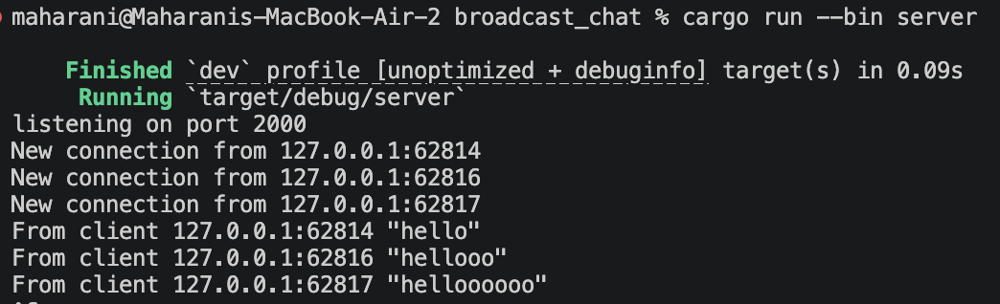
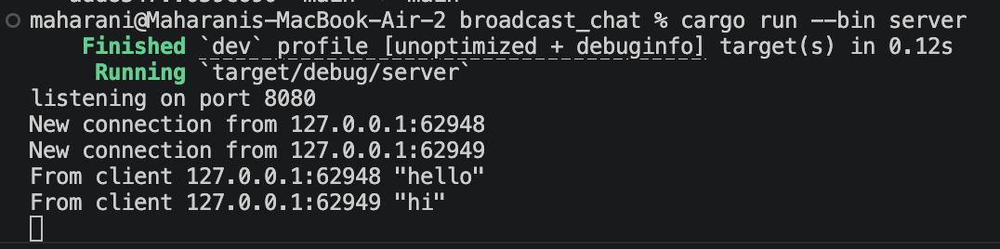
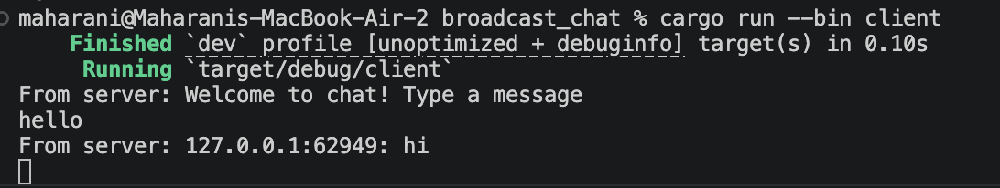
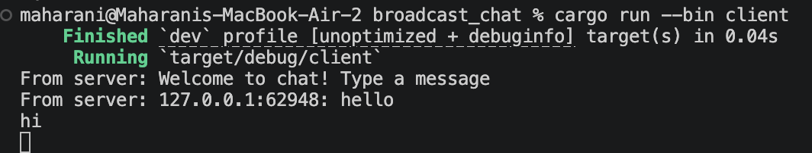

## Experiment 2.1: Original code of broadcast chat

**How to run it:**
To get this chat application working, I had to run the server and the clients separately. First, I opened a terminal and started the server using the command 'cargo run --bin server'. Then, I opened three terminal windows and ran 'cargo run --bin client' in each one to simulate three different users connecting to the chat room.

**What happens when you type text:**
When I type a message into one of the client terminals and press Enter, that message is sent over a WebSocket connection to the server. As shown in the server screenshot, the server registers the new connections and logs the incoming messages (like "hello", "hellooo", and "helloooooo") along with the IP address and port of the sender. The server then acts as a central hub, taking that message and broadcasting it out to all the other connected clients so everyone in the chat can see it.

## Experiment 2.2: Modifying the websocket port

**What I changed:**
To change the port to 8080, I had to modify both sides of the application because they must agree on where the connection happens. 
1. In `server.rs`, I changed the `TcpListener` to bind to `127.0.0.1:8080`.
2. In `client.rs`, I updated the `ClientBuilder` URI to connect to `ws://127.0.0.1:8080`.

**How it works:**
Yes, both sides are using the same websocket protocol. In the client code, this is defined by the `ws://` prefix in the URI, which stands for WebSocket. Under the hood, WebSockets start as a standard HTTP request and then "upgrade" into a persistent, two-way TCP connection, which is why our server uses `TcpListener::bind` to listen for those incoming requests!

## Experiment 2.3: Small changes, add IP and Port

**What I changed:**
To figure out who was sending which message, I updated the server code to attach the sender's IP address and port to their text. In `server.rs`, inside the incoming message match arm, I changed the broadcast line to `bcast_tx.send(format!("{addr}: {text}"));`. 

**How it works:**
Because the `handle_connection` function takes the client's `SocketAddr` as an argument, the server already knows exactly who is talking. By formatting the string before sending it to the `bcast_tx` channel, the server bundles the sender's identity and their message together. Now, when the clients receive a message, they can clearly see the origin IP and Port!

  

